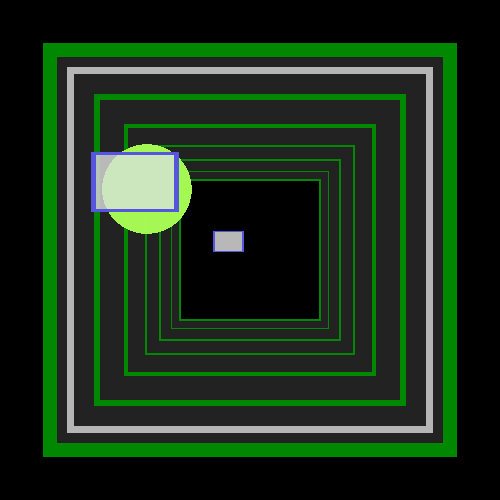
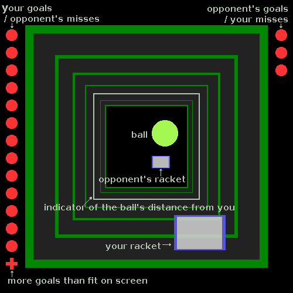

# Space tennis

A 3D pong game written in Rust using the [Piston](https://piston.rs) game engine.


## How to play / Game mechanics

The goal of the game is to block the ball from leaving the square tube at your side,
and make the computer-controlled oponent unable to do so at his end.  

The ball bounces of walls without changing speed, but will take up a percentage
of the velocity of the racket when it hits it.  
A new round is started when somebody misses, and the loser starts with the
ball attached to his racket.  
Move your racket with the mouse or arrow keys, and click any mouse button or
press space or enter to start the round when you have the ball.  
Clicking or pressing enter or space when the ball is moving will pause or
un-pause the game.

## Compiling

You need the Rust compiler and package manager, which can be downloaded from [rust-lang.org](https://rust-lang.org/en-US/install.html).
Then run these commands:

```sh
git clone https://github.com/tormol/space_tennis
cd space_tennis
cargo build --release
cargo run --release
```

### Hot Reloading Mode

To speed up the edit-compile-run cycle, most of the game logic can be compiled
as a dynamic library which is recompiled and reloaded when the source is changed.

This is enabled by the `dyn` feature:

```sh
cargo run --features dyn
```

The dynamic library has minimal dependencies, and compiles in 1,5 seconds on my
A10-4600M laptop, whereas the main program takes 4,3 seconds.
(Both examples are after minimal code changes.)

The compile times could be improved further by not going though cargo each time,
but build plans are an unstable cargo feature so that would be brittle.

I originally reloaded the executable, which would've made this trivial to reuse
for other games as all the game-specific code was there and the game engine
and reloading stuff was in a dynamic library. But newer versions of glibc or
libdl doesn't allow loading executables as dynamic libraries, so I had to
switch it around.  
Exporting symbols from an executable also required passing
`"-C link-args=-Wl,-export-dynamic"` via `RUSTFLAGS`, which would cause all
dependencies to be compiled again on the first reload if you forgot to set it
for the original `cargo build` or `cargo run`.

## License

Copyright 2018 Torbjørn Birch Moltu. Licensed under the
GNU General Public License, as published by the Free Software Foundation,
either version 3 of the License, or (at your option) any later version.
